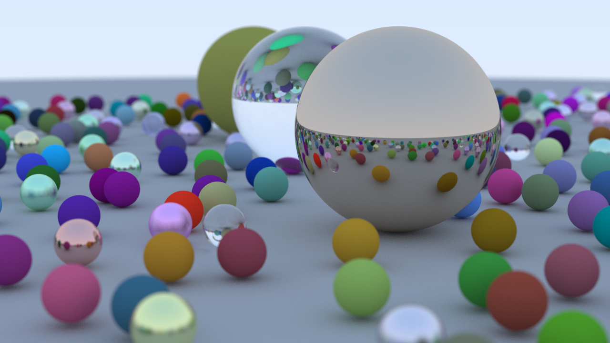

# raytracing-rs

Ray Tracing in one weekend, but in rust.

The code is based on this [tutorial](https://raytracing.github.io/books/RayTracingInOneWeekend.html) written in C++, with some different design approaches. That is the final image:

